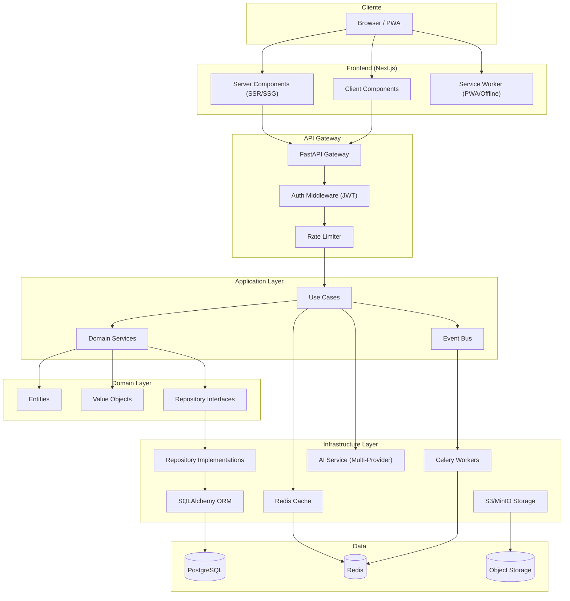
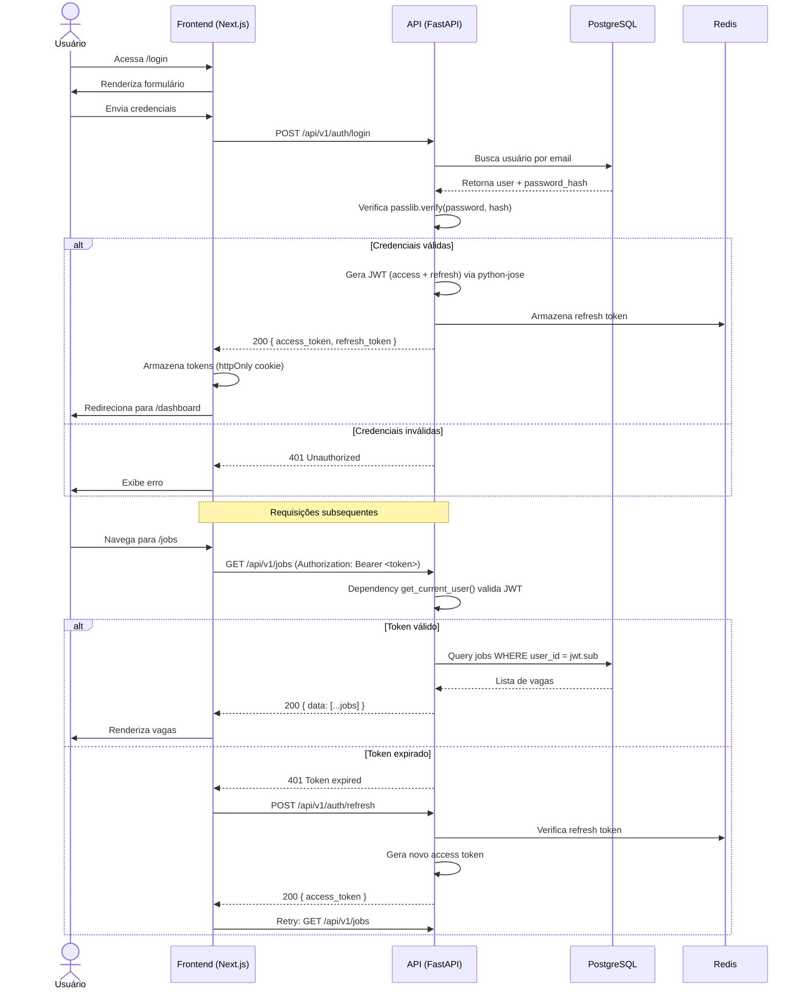
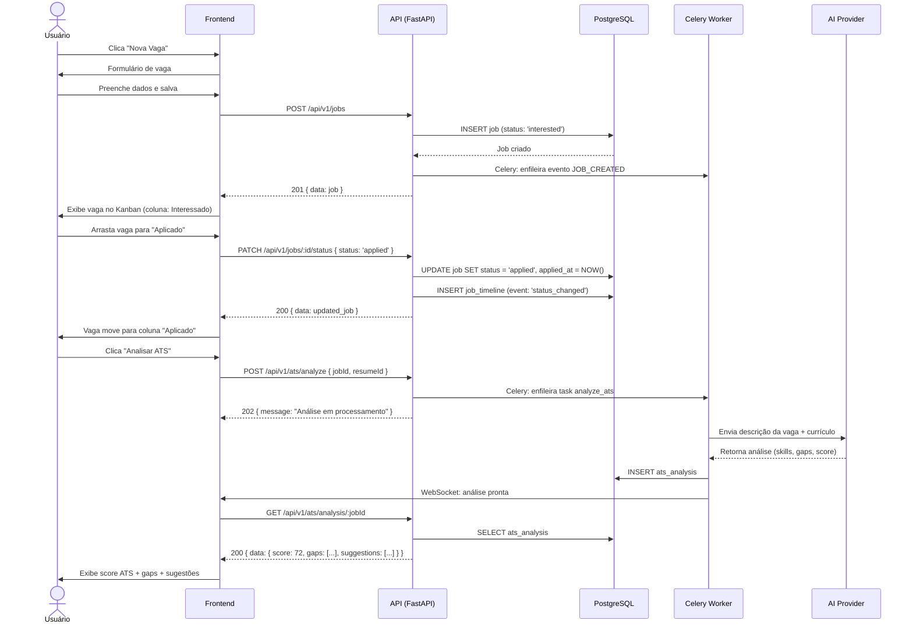
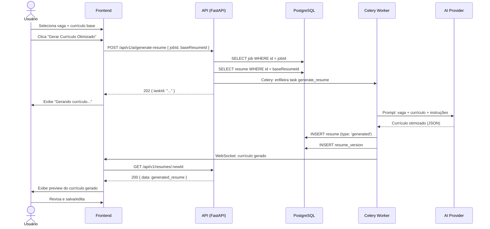
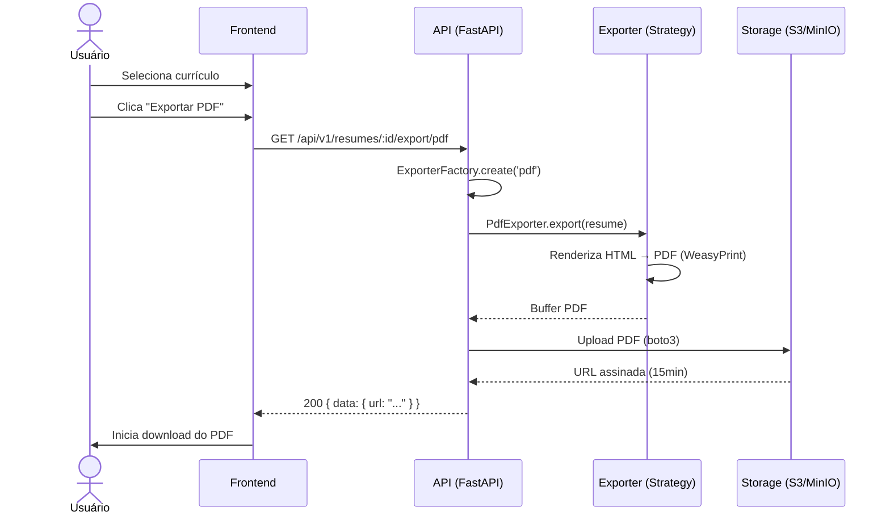
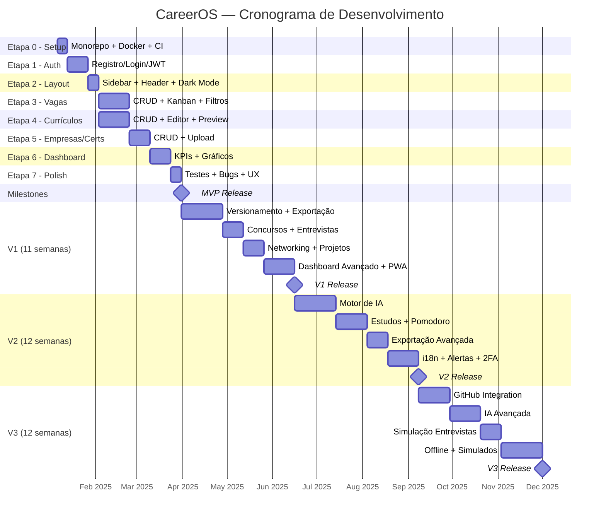

# 🏗️ CareerOS — Arquitetura e Engenharia

> Documento com diretrizes arquiteturais, modelagem de banco, APIs e infraestrutura.

# 7 — Arquitetura

## Visão Geral



## Princípios Arquiteturais

### Clean Architecture

```
┌──────────────────────────────────────────────┐
│              Frameworks & Drivers             │
│  (Next.js, FastAPI, SQLAlchemy, Redis, S3)    │
├──────────────────────────────────────────────┤
│            Interface Adapters                 │
│  (Controllers, Presenters, Gateways, DTOs)    │
├──────────────────────────────────────────────┤
│            Application Layer                  │
│  (Use Cases, Application Services, Events)    │
├──────────────────────────────────────────────┤
│              Domain Layer                     │
│  (Entities, Value Objects, Domain Services,   │
│   Repository Interfaces, Domain Events)       │
└──────────────────────────────────────────────┘
```

**Regra de dependência**: As camadas internas NUNCA dependem das externas. As dependências sempre apontam para dentro.

### Padrões Utilizados

| Padrão | Onde | Justificativa |
|---|---|---|
| **Repository Pattern** | Acesso a dados | Desacopla domain de infra; facilita testes com mocks |
| **Use Case Pattern** | Lógica de aplicação | Um caso de uso por arquivo; responsabilidade única |
| **Event-Driven** | Comunicação entre módulos | Desacoplamento; filas para tarefas assíncronas (IA, email) |
| **CQRS (simplificado)** | Queries complexas (Dashboard) | Separar leitura otimizada de escrita; views materializadas |
| **Strategy Pattern** | Exportação de currículo | Permite múltiplos formatos (PDF, DOCX, LaTeX) sem alterar o core |
| **Factory Pattern** | Criação de entidades | Validação e consistência na criação de objetos complexos |
| **Observer Pattern** | Notificações e alertas | Reação a eventos (certificado expirando, prazo de vaga) |

---

# 8 — Stack Tecnológica

## Decisões e Justificativas

### Frontend

| Tecnologia | Justificativa | Alternativas Consideradas |
|---|---|---|
| **Next.js 15 (App Router)** | SSR/SSG nativo, rotas baseadas em arquivos, React Server Components, ecossistema maduro, performance otimizada | Nuxt.js (Vue), Remix, SvelteKit |
| **TypeScript** | Type-safety, intellisense, detecção de erros em tempo de compilação, documentação implícita | JavaScript |
| **shadcn/ui** | Componentes acessíveis (Radix UI), copiados para o projeto (não é dependência), totalmente customizáveis | Chakra UI, Mantine, MUI |
| **Tailwind CSS v4** | Utility-first, design system consistente, integrado com shadcn/ui, purge automático | CSS Modules, Styled Components |
| **Zustand** | State management leve (~1KB), sem boilerplate, API simples, middleware para persistência | Redux Toolkit, Jotai, Recoil |
| **TanStack Query** | Cache automático de server state, refetch inteligente, optimistic updates, devtools | SWR, Apollo Client |
| **React Hook Form + Zod** | Formulários performáticos (uncontrolled), validação type-safe compartilhável com backend | Formik, Yup |

### Backend

| Tecnologia | Justificativa | Alternativas Consideradas |
|---|---|---|
| **Python 3.12** | Ecossistema IA nativo (LangChain, OpenAI, Ollama), async/await, tipagem moderna, comunidade massiva | Node.js, Go |
| **FastAPI** | Async nativo (essencial para chamadas de IA), Swagger/OpenAPI automático, Pydantic integrado, alta performance (Starlette + Uvicorn), Clean Architecture flexível | Django + DRF, Flask, NestJS |
| **Pydantic v2** | Validação type-safe, serialização automática, integrado ao FastAPI, schemas reutilizáveis | marshmallow, attrs |
| **SQLAlchemy 2.0 + Alembic** | ORM Python mais maduro, query builder poderoso, async support, Alembic para migrations versionadas | Django ORM, Tortoise ORM, Prisma (via bindings) |
| **uv** | Gerenciador de pacotes Python ultra-rápido (~100x pip), lockfile, resolver moderno | Poetry, pip + venv |

### Banco de Dados

| Tecnologia | Justificativa | Alternativas Consideradas |
|---|---|---|
| **PostgreSQL 16** | JSONB para dados semi-estruturados, full-text search nativo, extensões (pgvector para IA), robustez comprovada, transações ACID | MySQL 8, CockroachDB |

### Autenticação

| Tecnologia | Justificativa | Alternativas Consideradas |
|---|---|---|
| **FastAPI Security + python-jose (JWT)** | OAuth2 nativo no FastAPI, dependency injection para proteção de rotas, bcrypt via passlib | Auth.js (frontend only), Keycloak, Supabase Auth |

### Cache & Filas

| Tecnologia | Justificativa | Alternativas Consideradas |
|---|---|---|
| **Redis (Upstash para cloud)** | In-memory, pub/sub, sessions, rate limiting, sub-millisecond latency | DragonflyDB, Memcached |
| **Celery + Redis (broker)** | Padrão Python para task queues, retry com backoff, scheduled tasks, monitoramento via Flower | RQ (Redis Queue), Dramatiq, Huey |

### Storage

| Tecnologia | Justificativa | Alternativas Consideradas |
|---|---|---|
| **MinIO (dev) / S3 (prod)** | API S3 compatível, self-hosted gratuito para dev, transição transparente para cloud, boto3 nativo em Python | Cloudflare R2, GCS, Azure Blob |

### Cloud & Deploy

| Tecnologia | Justificativa | Alternativas Consideradas |
|---|---|---|
| **Vercel (frontend)** | Deploy automático Next.js, edge functions, preview deploys, free tier generoso | Netlify, Cloudflare Pages |
| **Railway (backend + DB)** | PaaS simples, PostgreSQL + Redis inclusos, deploy de Docker, preço previsível | Render, Fly.io, AWS ECS |
| **Docker + Docker Compose** | Ambiente local reprodutível, consistência dev/prod, orquestração simples | Podman |

### CI/CD

| Tecnologia | Justificativa | Alternativas Consideradas |
|---|---|---|
| **GitHub Actions** | Integração nativa com GitHub, marketplace de actions, gratuito para repos públicos | GitLab CI, CircleCI |

### Monitoramento & Observabilidade

| Tecnologia | Justificativa | Alternativas Consideradas |
|---|---|---|
| **Sentry** | Error tracking, performance monitoring, release tracking, source maps | Bugsnag, Rollbar |
| **Grafana + Prometheus** | Dashboards customizados, métricas de aplicação, alertas | Datadog, New Relic |
| **Loguru** | Logger Python elegante, formatação automática, rotação de arquivos, integração com Sentry | structlog, logging (stdlib) |

### Testes

| Tecnologia | Justificativa | Alternativas Consideradas |
|---|---|---|
| **Pytest + httpx** | Framework de testes Python padrão, fixtures, parametrize; httpx para testar endpoints async | unittest |
| **Testing Library** | Testa comportamento no frontend (React), acessível, padrão da comunidade | Enzyme |
| **Playwright** | E2E cross-browser, auto-wait, trace viewer, codegen | Cypress, Puppeteer |
| **Factory Boy** | Factories para gerar dados de teste, integração com SQLAlchemy | Faker standalone |

### IA — Abordagem Multi-Provider (Chaves do Usuário)

O CareerOS **não paga pela IA**. O usuário conecta sua própria API key e escolhe o provider na tela de Settings. A arquitetura suporta múltiplos providers via Strategy Pattern:

| Provider | Custo p/ Usuário | Qualidade | Observações |
|---|---|---|---|
| **🥇 Ollama (local)** | **R$ 0 (grátis para sempre)** | ⭐⭐⭐–⭐⭐⭐⭐ | Roda Llama 3.1, Mistral, Qwen na máquina do usuário. Precisa GPU 8GB+ ou roda em CPU |
| **🥈 Google Gemini** | **R$ 0 (free tier: 1500 req/dia)** | ⭐⭐⭐⭐ | API key gratuita via Google AI Studio. Gemini Flash = rápido e barato |
| **🥉 Groq** | **R$ 0 (free tier: 30 req/min)** | ⭐⭐⭐⭐ | Roda Llama 3.1 70B com latência ~200ms. Free tier generoso |
| **OpenRouter** | Varia (~$0.10–$5/1M tokens) | ⭐⭐⭐⭐⭐ | Hub que agrega GPT-4o, Claude, Gemini, Llama. 1 API key acessa tudo |
| **OpenAI** | ~$2–50/mês (uso moderado) | ⭐⭐⭐⭐⭐ | GPT-4o-mini é barato (~$0.15/1M tokens). GPT-4o para tarefas complexas |
| **Anthropic (Claude)** | ~$3–30/mês | ⭐⭐⭐⭐⭐ | Excelente para geração de texto longo (cartas, currículos) |

**Implementação no backend (Python):**

```python
# app/modules/ai/providers/base.py
from abc import ABC, abstractmethod

class AiProvider(ABC):
    @abstractmethod
    async def generate_text(self, prompt: str, **kwargs) -> str: ...

    @abstractmethod
    async def generate_json(self, prompt: str, schema: dict) -> dict: ...

# app/modules/ai/providers/ollama_provider.py
class OllamaProvider(AiProvider):
    async def generate_text(self, prompt: str, **kwargs) -> str:
        response = await ollama.AsyncClient().chat(
            model=self.model, messages=[{"role": "user", "content": prompt}]
        )
        return response["message"]["content"]

# app/modules/ai/providers/gemini_provider.py
class GeminiProvider(AiProvider): ...

# app/modules/ai/providers/groq_provider.py
class GroqProvider(AiProvider): ...

# app/modules/ai/providers/openai_provider.py
class OpenAIProvider(AiProvider): ...

# app/modules/ai/factory.py
def get_ai_provider(user_settings: UserSettings) -> AiProvider:
    providers = {
        "ollama": OllamaProvider,
        "gemini": GeminiProvider,
        "groq": GroqProvider,
        "openrouter": OpenRouterProvider,
        "openai": OpenAIProvider,
    }
    return providers[user_settings.ai_provider](api_key=user_settings.ai_api_key)
```

**Tela de Settings do usuário:**

```
┌─────────────────────────────────────┐
│  ⚙️ Configurações de IA             │
│                                     │
│  Provider:  [Ollama (local)     ▾]  │
│  API Key:   [__________________]    │
│  Modelo:    [llama3.1:8b        ▾]  │
│                                     │
│  [Testar Conexão]  [Salvar]         │
└─────────────────────────────────────┘
```

| Tecnologia de suporte | Justificativa | Alternativas |
|---|---|---|
| **LangChain Python** | Abstrações para chains, prompts, output parsers; versão principal (mais features que JS) | LlamaIndex, SDK direto de cada provider |
| **pgvector** | Armazenamento de embeddings no PostgreSQL, busca semântica para matching currículo⟷vaga | Pinecone, Weaviate, ChromaDB |

---

# 9 — Modelagem do Banco

## Diagrama Entidade-Relacionamento

```mermaid
erDiagram
    USER {
        uuid id PK
        string email UK
        string password_hash
        string name
        string avatar_url
        json preferences
        timestamp created_at
        timestamp updated_at
    }

    RESUME {
        uuid id PK
        uuid user_id FK
        string title
        string type "master|python|cloud|backend|ia|security|custom"
        json content
        boolean is_master
        int current_version
        timestamp created_at
        timestamp updated_at
    }

    RESUME_VERSION {
        uuid id PK
        uuid resume_id FK
        int version_number
        json content
        string change_description
        timestamp created_at
    }

    JOB {
        uuid id PK
        uuid user_id FK
        uuid company_id FK
        string title
        string description
        string url
        string status "interested|applied|screening|interview|offer|rejected|withdrawn"
        decimal salary_min
        decimal salary_max
        string currency
        string location
        string work_model "remote|hybrid|onsite"
        date deadline
        json notes
        json checklist
        boolean is_favorite
        timestamp applied_at
        timestamp created_at
        timestamp updated_at
    }

    JOB_ATTACHMENT {
        uuid id PK
        uuid job_id FK
        string file_name
        string file_url
        string file_type
        timestamp created_at
    }

    JOB_TIMELINE {
        uuid id PK
        uuid job_id FK
        string event_type
        string description
        json metadata
        timestamp created_at
    }

    ATS_ANALYSIS {
        uuid id PK
        uuid job_id FK
        uuid resume_id FK
        float score
        json extracted_skills
        json extracted_technologies
        json extracted_soft_skills
        json experience_requirements
        json language_requirements
        json keywords
        json gaps
        json suggestions
        timestamp analyzed_at
    }

    COMPANY {
        uuid id PK
        uuid user_id FK
        string name
        string industry
        string website
        string size
        json benefits
        decimal salary_range_min
        decimal salary_range_max
        json technologies
        text notes
        float rating
        timestamp created_at
        timestamp updated_at
    }

    CERTIFICATE {
        uuid id PK
        uuid user_id FK
        string title
        string institution
        string category
        int hours
        date issue_date
        date expiry_date
        string credential_id
        string credential_url
        string file_url
        timestamp created_at
        timestamp updated_at
    }

    PROJECT {
        uuid id PK
        uuid user_id FK
        string title
        text description
        string github_url
        string live_url
        json technologies
        string status "active|archived|planned"
        timestamp created_at
        timestamp updated_at
    }

    PROJECT_RESUME {
        uuid project_id FK
        uuid resume_id FK
    }

    INTERVIEW {
        uuid id PK
        uuid job_id FK
        uuid user_id FK
        string type "technical|behavioral|system_design|coding|hr|final"
        datetime scheduled_at
        string interviewer_name
        string interviewer_role
        json questions
        text feedback
        string result "passed|failed|pending|cancelled"
        text notes
        timestamp created_at
        timestamp updated_at
    }

    CONTACT {
        uuid id PK
        uuid user_id FK
        uuid company_id FK
        string name
        string role
        string email
        string phone
        string linkedin_url
        text notes
        date last_contact_at
        int follow_up_days
        timestamp created_at
        timestamp updated_at
    }

    SKILL {
        uuid id PK
        uuid user_id FK
        string name
        string category "language|framework|tool|soft_skill|methodology"
        string level "beginner|intermediate|advanced|expert"
        int years_experience
        timestamp created_at
    }

    COVER_LETTER {
        uuid id PK
        uuid user_id FK
        uuid job_id FK
        string title
        text content
        boolean is_generated
        timestamp created_at
        timestamp updated_at
    }

    EXAM {
        uuid id PK
        uuid user_id FK
        string title
        string organization
        string examining_board
        date registration_deadline
        date exam_date
        date result_date
        string status "planned|registered|studying|taken|passed|failed"
        json disciplines
        json schedule
        text notes
        timestamp created_at
        timestamp updated_at
    }

    STUDY {
        uuid id PK
        uuid user_id FK
        string title
        string type "course|book|video|article|roadmap"
        string category
        string provider
        string url
        int total_hours
        int completed_hours
        float progress
        string status "not_started|in_progress|completed|abandoned"
        timestamp created_at
        timestamp updated_at
    }

    STUDY_SESSION {
        uuid id PK
        uuid study_id FK
        uuid user_id FK
        int duration_minutes
        string technique "pomodoro|free|timed"
        text notes
        timestamp started_at
        timestamp ended_at
    }

    USER ||--o{ RESUME : "has"
    USER ||--o{ JOB : "tracks"
    USER ||--o{ COMPANY : "tracks"
    USER ||--o{ CERTIFICATE : "has"
    USER ||--o{ PROJECT : "has"
    USER ||--o{ INTERVIEW : "has"
    USER ||--o{ CONTACT : "has"
    USER ||--o{ SKILL : "has"
    USER ||--o{ COVER_LETTER : "has"
    USER ||--o{ EXAM : "tracks"
    USER ||--o{ STUDY : "tracks"
    RESUME ||--o{ RESUME_VERSION : "has versions"
    JOB ||--o{ JOB_ATTACHMENT : "has"
    JOB ||--o{ JOB_TIMELINE : "has"
    JOB ||--o{ ATS_ANALYSIS : "has"
    JOB ||--o{ INTERVIEW : "has"
    JOB ||--o| COVER_LETTER : "has"
    JOB }o--|| COMPANY : "belongs to"
    RESUME ||--o{ ATS_ANALYSIS : "analyzed against"
    PROJECT }o--o{ RESUME : "linked via PROJECT_RESUME"
    CONTACT }o--o| COMPANY : "works at"
    STUDY ||--o{ STUDY_SESSION : "has"

    JOB }o--o{ SKILL : "requires"
    RESUME }o--o{ SKILL : "includes"
```



## Tabelas de Junção (Many-to-Many)

| Tabela | Relação |
|---|---|
| `project_resume` | Projetos ↔ Currículos |
| `job_skill` | Vagas ↔ Skills (requisitos) |
| `resume_skill` | Currículos ↔ Skills (incluídas) |

## Índices Importantes

```sql
-- Performance queries mais frequentes
CREATE INDEX idx_job_user_status ON job(user_id, status);
CREATE INDEX idx_job_user_favorite ON job(user_id, is_favorite) WHERE is_favorite = true;
CREATE INDEX idx_resume_user_type ON resume(user_id, type);
CREATE INDEX idx_certificate_user_expiry ON certificate(user_id, expiry_date);
CREATE INDEX idx_interview_scheduled ON interview(user_id, scheduled_at);
CREATE INDEX idx_contact_last_contact ON contact(user_id, last_contact_at);
CREATE INDEX idx_study_session_user ON study_session(user_id, started_at);

-- Full-text search
CREATE INDEX idx_job_search ON job USING gin(to_tsvector('portuguese', title || ' ' || description));
CREATE INDEX idx_company_search ON company USING gin(to_tsvector('portuguese', name));
```

---

# 10 — APIs

## Convenções

### Base URL
```
/api/v1
```

### Padrão de Resposta (Envelope Pattern)
```json
{
  "success": true,
  "data": { ... },
  "meta": {
    "page": 1,
    "per_page": 20,
    "total": 150,
    "total_pages": 8
  },
  "errors": null
}
```

### Padrão de Erro
```json
{
  "success": false,
  "data": null,
  "errors": [
    {
      "code": "VALIDATION_ERROR",
      "message": "O campo 'title' é obrigatório",
      "field": "title"
    }
  ]
}
```

### Headers Padrão
```
Authorization: Bearer <jwt_token>
Content-Type: application/json
Accept-Language: pt-BR
X-Request-ID: <uuid>
```

### Rate Limiting
- Autenticado: 100 req/min
- IA endpoints: 10 req/min
- Não autenticado: 20 req/min

## Endpoints por Módulo

### Auth
| Método | Endpoint | Descrição |
|---|---|---|
| POST | `/auth/register` | Registro de usuário |
| POST | `/auth/login` | Login (retorna JWT) |
| POST | `/auth/refresh` | Refresh token |
| POST | `/auth/forgot-password` | Solicitar recuperação de senha |
| POST | `/auth/reset-password` | Resetar senha com token |
| GET | `/auth/me` | Dados do usuário autenticado |
| PATCH | `/auth/me` | Atualizar perfil |

### Dashboard
| Método | Endpoint | Descrição |
|---|---|---|
| GET | `/dashboard/kpis` | KPIs agregados |
| GET | `/dashboard/activity` | Heatmap de atividade |
| GET | `/dashboard/upcoming` | Próximos prazos e entrevistas |
| GET | `/dashboard/charts` | Dados para gráficos |

### Vagas (Jobs)
| Método | Endpoint | Descrição |
|---|---|---|
| GET | `/jobs` | Listar vagas (paginado, filtros) |
| POST | `/jobs` | Criar vaga |
| GET | `/jobs/:id` | Detalhes da vaga |
| PATCH | `/jobs/:id` | Atualizar vaga |
| DELETE | `/jobs/:id` | Excluir vaga |
| PATCH | `/jobs/:id/status` | Atualizar status (Kanban) |
| POST | `/jobs/:id/favorite` | Favoritar/desfavoritar |
| GET | `/jobs/:id/timeline` | Timeline da vaga |
| POST | `/jobs/:id/attachments` | Upload de anexo |
| DELETE | `/jobs/:id/attachments/:attachmentId` | Remover anexo |
| POST | `/jobs/import` | Importar vaga por URL |

### ATS
| Método | Endpoint | Descrição |
|---|---|---|
| POST | `/ats/analyze` | Analisar vaga (IA) |
| GET | `/ats/analysis/:jobId` | Resultado da análise |
| POST | `/ats/compare` | Comparar currículo vs vaga |
| GET | `/ats/suggestions/:analysisId` | Sugestões de melhoria |

### Currículos (Resumes)
| Método | Endpoint | Descrição |
|---|---|---|
| GET | `/resumes` | Listar currículos |
| POST | `/resumes` | Criar currículo |
| GET | `/resumes/:id` | Detalhes do currículo |
| PATCH | `/resumes/:id` | Atualizar currículo |
| DELETE | `/resumes/:id` | Excluir currículo |
| GET | `/resumes/:id/versions` | Listar versões |
| POST | `/resumes/:id/versions` | Criar nova versão |
| GET | `/resumes/:id/versions/:version` | Ver versão específica |
| POST | `/resumes/:id/versions/:version/restore` | Restaurar versão |
| GET | `/resumes/:id/export/:format` | Exportar (pdf/docx/md/latex/json) |
| POST | `/resumes/generate` | Gerar currículo por IA |

### Empresas (Companies)
| Método | Endpoint | Descrição |
|---|---|---|
| GET | `/companies` | Listar empresas |
| POST | `/companies` | Criar empresa |
| GET | `/companies/:id` | Detalhes |
| PATCH | `/companies/:id` | Atualizar |
| DELETE | `/companies/:id` | Excluir |

### Certificados (Certificates)
| Método | Endpoint | Descrição |
|---|---|---|
| GET | `/certificates` | Listar certificados |
| POST | `/certificates` | Criar certificado |
| GET | `/certificates/:id` | Detalhes |
| PATCH | `/certificates/:id` | Atualizar |
| DELETE | `/certificates/:id` | Excluir |
| POST | `/certificates/:id/upload` | Upload do PDF |
| GET | `/certificates/expiring` | Certificados próximos de expirar |

### Projetos (Projects)
| Método | Endpoint | Descrição |
|---|---|---|
| GET | `/projects` | Listar projetos |
| POST | `/projects` | Criar projeto |
| GET | `/projects/:id` | Detalhes |
| PATCH | `/projects/:id` | Atualizar |
| DELETE | `/projects/:id` | Excluir |
| POST | `/projects/:id/link-resume` | Vincular a currículo |

### Concursos (Exams)
| Método | Endpoint | Descrição |
|---|---|---|
| GET | `/exams` | Listar concursos |
| POST | `/exams` | Criar concurso |
| GET | `/exams/:id` | Detalhes |
| PATCH | `/exams/:id` | Atualizar |
| DELETE | `/exams/:id` | Excluir |
| POST | `/exams/:id/study-plan` | Gerar plano de estudos (IA) |
| POST | `/exams/:id/simulate` | Gerar simulado (IA) |

### Entrevistas (Interviews)
| Método | Endpoint | Descrição |
|---|---|---|
| GET | `/interviews` | Listar entrevistas |
| POST | `/interviews` | Criar entrevista |
| GET | `/interviews/:id` | Detalhes |
| PATCH | `/interviews/:id` | Atualizar |
| DELETE | `/interviews/:id` | Excluir |
| POST | `/interviews/simulate` | Simular entrevista (IA) |

### Networking (Contacts)
| Método | Endpoint | Descrição |
|---|---|---|
| GET | `/contacts` | Listar contatos |
| POST | `/contacts` | Criar contato |
| GET | `/contacts/:id` | Detalhes |
| PATCH | `/contacts/:id` | Atualizar |
| DELETE | `/contacts/:id` | Excluir |
| GET | `/contacts/follow-ups` | Contatos que precisam de follow-up |

### Estudos (Studies)
| Método | Endpoint | Descrição |
|---|---|---|
| GET | `/studies` | Listar recursos de estudo |
| POST | `/studies` | Criar recurso |
| GET | `/studies/:id` | Detalhes |
| PATCH | `/studies/:id` | Atualizar |
| DELETE | `/studies/:id` | Excluir |
| POST | `/studies/:id/sessions` | Registrar sessão de estudo |
| GET | `/studies/stats` | Estatísticas (horas, progresso) |

### Cover Letters
| Método | Endpoint | Descrição |
|---|---|---|
| GET | `/cover-letters` | Listar cartas |
| POST | `/cover-letters` | Criar carta |
| GET | `/cover-letters/:id` | Detalhes |
| PATCH | `/cover-letters/:id` | Atualizar |
| DELETE | `/cover-letters/:id` | Excluir |
| POST | `/cover-letters/generate` | Gerar por IA |

### Skills
| Método | Endpoint | Descrição |
|---|---|---|
| GET | `/skills` | Listar habilidades do usuário |
| POST | `/skills` | Adicionar habilidade |
| PATCH | `/skills/:id` | Atualizar nível |
| DELETE | `/skills/:id` | Remover |

### IA
| Método | Endpoint | Descrição |
|---|---|---|
| POST | `/ai/analyze-job` | Análise ATS de vaga |
| POST | `/ai/generate-resume` | Gerar currículo otimizado |
| POST | `/ai/generate-cover-letter` | Gerar carta de apresentação |
| POST | `/ai/generate-platform-response` | Gerar resposta para plataforma (Gupy, LinkedIn, Workday, Greenhouse) |
| POST | `/ai/generate-study-plan` | Gerar plano de estudos |
| POST | `/ai/generate-interview-questions` | Gerar perguntas de entrevista |
| POST | `/ai/generate-career-plan` | Gerar plano de carreira |
| POST | `/ai/compare-resume-job` | Comparar currículo com vaga |

---

## Estrutura do Projeto

```
careeeros/
├── .github/
│   └── workflows/
│       ├── ci.yml                    # Lint, test, build
│       ├── deploy-web.yml            # Deploy frontend (Vercel)
│       └── deploy-api.yml            # Deploy backend (Railway)
├── docker/
│   ├── docker-compose.yml            # Dev environment
│   ├── docker-compose.prod.yml       # Production
│   ├── Dockerfile.api                # Backend container (Python)
│   └── Dockerfile.web                # Frontend container
├── apps/
│   ├── web/                          # Frontend Next.js
│   │   ├── public/
│   │   │   ├── icons/
│   │   │   ├── manifest.json         # PWA
│   │   │   └── sw.js                 # Service Worker
│   │   ├── src/
│   │   │   ├── app/                  # Next.js App Router
│   │   │   │   ├── (auth)/
│   │   │   │   │   ├── login/
│   │   │   │   │   │   └── page.tsx
│   │   │   │   │   └── register/
│   │   │   │   │       └── page.tsx
│   │   │   │   ├── (dashboard)/
│   │   │   │   │   ├── layout.tsx
│   │   │   │   │   ├── page.tsx      # Dashboard
│   │   │   │   │   ├── jobs/
│   │   │   │   │   │   ├── page.tsx  # Lista/Kanban
│   │   │   │   │   │   └── [id]/
│   │   │   │   │   │       └── page.tsx
│   │   │   │   │   ├── resumes/
│   │   │   │   │   │   ├── page.tsx
│   │   │   │   │   │   └── [id]/
│   │   │   │   │   │       ├── page.tsx
│   │   │   │   │   │       └── edit/
│   │   │   │   │   │           └── page.tsx
│   │   │   │   │   ├── companies/
│   │   │   │   │   │   └── ...
│   │   │   │   │   ├── certificates/
│   │   │   │   │   │   └── ...
│   │   │   │   │   ├── projects/
│   │   │   │   │   │   └── ...
│   │   │   │   │   ├── exams/
│   │   │   │   │   │   └── ...
│   │   │   │   │   ├── interviews/
│   │   │   │   │   │   └── ...
│   │   │   │   │   ├── contacts/
│   │   │   │   │   │   └── ...
│   │   │   │   │   ├── studies/
│   │   │   │   │   │   └── ...
│   │   │   │   │   └── settings/
│   │   │   │   │       └── page.tsx
│   │   │   │   ├── layout.tsx        # Root layout
│   │   │   │   └── globals.css
│   │   │   ├── components/
│   │   │   │   ├── ui/               # shadcn/ui components
│   │   │   │   │   ├── button.tsx
│   │   │   │   │   ├── card.tsx
│   │   │   │   │   ├── dialog.tsx
│   │   │   │   │   └── ...
│   │   │   │   ├── layout/
│   │   │   │   │   ├── sidebar.tsx
│   │   │   │   │   ├── header.tsx
│   │   │   │   │   ├── nav-item.tsx
│   │   │   │   │   └── theme-toggle.tsx
│   │   │   │   ├── dashboard/
│   │   │   │   │   ├── kpi-card.tsx
│   │   │   │   │   ├── activity-heatmap.tsx
│   │   │   │   │   └── upcoming-deadlines.tsx
│   │   │   │   ├── jobs/
│   │   │   │   │   ├── job-card.tsx
│   │   │   │   │   ├── job-kanban.tsx
│   │   │   │   │   ├── job-form.tsx
│   │   │   │   │   └── job-filters.tsx
│   │   │   │   ├── resumes/
│   │   │   │   │   ├── resume-editor.tsx
│   │   │   │   │   ├── resume-preview.tsx
│   │   │   │   │   └── version-history.tsx
│   │   │   └── ...
│   │   ├── hooks/
│   │   │   ├── use-jobs.ts
│   │   │   ├── use-resumes.ts
│   │   │   ├── use-theme.ts
│   │   │   └── use-auth.ts
│   │   ├── lib/
│   │   │   ├── api.ts            # API client (fetch wrapper)
│   │   │   └── utils.ts
│   │   ├── stores/
│   │   │   ├── theme-store.ts
│   │   │   └── ui-store.ts
│   │   └── styles/
│   │       └── globals.css
│   ├── next.config.ts
│   ├── tailwind.config.ts
│   ├── tsconfig.json
│   └── package.json
│
│   └── api/                          # Backend FastAPI (Python)
│       ├── app/
│       │   ├── main.py               # FastAPI app + startup
│       │   ├── config.py             # Settings (pydantic-settings)
│       │   ├── database.py           # SQLAlchemy engine + async session
│       │   ├── dependencies.py       # Dependency injection
│       │   │
│       │   ├── core/
│       │   │   ├── security.py       # JWT, hashing (passlib), OAuth2
│       │   │   ├── exceptions.py     # Custom exceptions + handlers
│       │   │   ├── middleware.py     # CORS, logging, rate limit
│       │   │   └── response.py      # Envelope pattern
│       │   │
│       │   ├── modules/
│       │   │   ├── auth/
│       │   │   │   ├── router.py
│       │   │   │   ├── service.py
│       │   │   │   ├── schemas.py    # Pydantic models
│       │   │   │   ├── models.py     # SQLAlchemy models
│       │   │   │   └── dependencies.py
│       │   │   ├── jobs/
│       │   │   │   ├── router.py
│       │   │   │   ├── service.py
│       │   │   │   ├── repository.py
│       │   │   │   ├── schemas.py
│       │   │   │   ├── models.py
│       │   │   │   └── use_cases/
│       │   │   │       ├── create_job.py
│       │   │   │       ├── update_job_status.py
│       │   │   │       └── import_job.py
│       │   │   ├── resumes/
│       │   │   │   ├── router.py
│       │   │   │   ├── service.py
│       │   │   │   ├── repository.py
│       │   │   │   ├── schemas.py
│       │   │   │   ├── models.py
│       │   │   │   ├── use_cases/
│       │   │   │   └── exporters/
│       │   │   │       ├── base.py           # Strategy interface (ABC)
│       │   │   │       ├── pdf_exporter.py
│       │   │   │       ├── docx_exporter.py
│       │   │   │       ├── markdown_exporter.py
│       │   │   │       └── latex_exporter.py
│       │   │   ├── companies/
│       │   │   │   └── ...  (mesmo padrão)
│       │   │   ├── certificates/
│       │   │   │   └── ...
│       │   │   ├── projects/
│       │   │   │   └── ...
│       │   │   ├── exams/
│       │   │   │   └── ...
│       │   │   ├── interviews/
│       │   │   │   └── ...
│       │   │   ├── contacts/
│       │   │   │   └── ...
│       │   │   ├── studies/
│       │   │   │   └── ...
│       │   │   ├── cover_letters/
│       │   │   │   └── ...
│       │   │   ├── skills/
│       │   │   │   └── ...
│       │   │   ├── dashboard/
│       │   │   │   ├── router.py
│       │   │   │   └── service.py
│       │   │   └── ai/
│       │   │       ├── router.py
│       │   │       ├── service.py
│       │   │       ├── providers/
│       │   │       │   ├── base.py           # AiProvider ABC
│       │   │       │   ├── ollama_provider.py
│       │   │       │   ├── gemini_provider.py
│       │   │       │   ├── groq_provider.py
│       │   │       │   ├── openrouter_provider.py
│       │   │       │   ├── openai_provider.py
│       │   │       │   └── factory.py
│       │   │       ├── prompts/
│       │   │       │   ├── ats_analysis.py
│       │   │       │   ├── resume_generation.py
│       │   │       │   ├── cover_letter.py
│       │   │       │   └── interview_questions.py
│       │   │       └── use_cases/
│       │   │           ├── analyze_job.py
│       │   │           ├── generate_resume.py
│       │   │           └── compare_resume_job.py
│       │   │
│       │   └── migrations/               # Alembic
│       │       ├── env.py
│       │       └── versions/
│       │
│       ├── tests/
│       │   ├── conftest.py
│       │   ├── unit/
│       │   ├── integration/
│       │   └── e2e/
│       │
│       ├── celery_app.py                 # Celery config + tasks
│       ├── pyproject.toml                # Dependencies (uv)
│       ├── alembic.ini
│       ├── Dockerfile
│       └── .python-version
│
├── .env.example
├── .gitignore
├── PROJECT.md
├── README.md
└── LICENSE
```

---

# 12 — Fluxos

## Fluxo de Autenticação



## Fluxo de Candidatura a Vaga



## Fluxo de Geração de Currículo por IA



## Fluxo de Exportação de Currículo



---

# 13 — Wireframes

## Descrição das Telas Principais

### Dashboard

```
┌──────────────────────────────────────────────────────────────────────┐
│  🧭 CareerOS                      🔍 Busca    🌙    👤 Lucas       │
├────────┬─────────────────────────────────────────────────────────────┤
│        │                                                             │
│  📊    │  ┌─────────┐ ┌─────────┐ ┌─────────┐ ┌─────────┐         │
│  Dash  │  │ 24      │ │ 33%     │ │ 8       │ │ R$ 12k  │         │
│        │  │ Candid. │ │ Retorno │ │ Entrev. │ │ Méd.Sal │         │
│  💼    │  └─────────┘ └─────────┘ └─────────┘ └─────────┘         │
│  Vagas │                                                             │
│        │  ┌─────────────────────────┐ ┌─────────────────────────┐   │
│  📄    │  │     Heatmap Atividade   │ │    Próximos Prazos      │   │
│  CVs   │  │  ░░▓▓░▓▓▓░░▓░░▓▓▓░░   │ │  📅 Entrevista TechCo  │   │
│        │  │  ▓░░░▓░░▓▓▓░▓░░░▓▓░   │ │  📅 Prazo vaga DataInc  │   │
│  🏢    │  │  ░▓▓░░░▓░▓▓░░▓▓░░▓░   │ │  📅 Cert. AWS expira   │   │
│  Empr. │  └─────────────────────────┘ └─────────────────────────┘   │
│        │                                                             │
│  🎓    │  ┌─────────────────────────┐ ┌─────────────────────────┐   │
│  Certs │  │    Candidaturas/Mês     │ │       Metas Semanais    │   │
│        │  │  📈 gráfico de linha    │ │  ✅ 5 candidaturas      │   │
│  📁    │  │     com tendência       │ │  ⬜ 2 entrevistas       │   │
│  Proj. │  │                         │ │  ✅ 10h estudo          │   │
│        │  └─────────────────────────┘ └─────────────────────────┘   │
│  📝    │                                                             │
│  Conc. │  ┌─────────────────────────────────────────────────────┐   │
│        │  │              Calendário Semanal                      │   │
│  📞    │  │  Seg   Ter   Qua   Qui   Sex   Sab   Dom           │   │
│  Rede  │  │  ───   ───   ───   ───   ───   ───   ───           │   │
│        │  │  ●     ●●    ●            ●                         │   │
│  📚    │  └─────────────────────────────────────────────────────┘   │
│  Estud │                                                             │
│        │                                                             │
│  🤖    │                                                             │
│  IA    │                                                             │
│        │                                                             │
│  ⚙️    │                                                             │
│  Config│                                                             │
│        │                                                             │
└────────┴─────────────────────────────────────────────────────────────┘
```

### Kanban de Vagas

```
┌──────────────────────────────────────────────────────────────────────┐
│  Vagas                    [+ Nova Vaga]   🔍 Filtrar    ☰ ⊞ 📅     │
├──────────────────────────────────────────────────────────────────────┤
│                                                                       │
│  Interessado (5)   Aplicado (8)    Entrevista (3)  Oferta (1)  ✗(2) │
│  ┌──────────┐     ┌──────────┐    ┌──────────┐   ┌────────┐  ┌───┐ │
│  │ Sr. Dev  │     │ Staff Eng│    │ Tech Lead│   │ CTO    │  │...│ │
│  │ TechCorp │     │ StartupX │    │ BigCo    │   │ NewCo  │  │   │ │
│  │ R$18-22k │     │ USD 8k   │    │ R$25k    │   │ R$30k  │  │   │ │
│  │ ⭐ 🏷️    │     │ ⭐       │    │ 📅 23/01 │   │ 🎉     │  │   │ │
│  │ ATS: 85% │     │ ATS: 72% │    │ ATS: 91% │   │        │  │   │ │
│  └──────────┘     └──────────┘    └──────────┘   └────────┘  └───┘ │
│  ┌──────────┐     ┌──────────┐    ┌──────────┐                      │
│  │ Backend  │     │ SRE      │    │ DevOps   │                      │
│  │ DataInc  │     │ CloudCo  │    │ FinTech  │                      │
│  │ R$15-18k │     │ R$20k    │    │ R$22k    │                      │
│  │          │     │ ATS: 68% │    │ ATS: 78% │                      │
│  └──────────┘     └──────────┘    └──────────┘                      │
│                                                                       │
└──────────────────────────────────────────────────────────────────────┘
```

### Editor de Currículo

```
┌──────────────────────────────────────────────────────────────────────┐
│  Currículo: Python Backend       v3    [Exportar ▾]  [🤖 Gerar IA] │
├────────────────────────────┬─────────────────────────────────────────┤
│                            │                                         │
│  Seções                    │  Preview                                │
│  ┌──────────────────────┐  │  ┌─────────────────────────────────┐   │
│  │ ✏️ Dados Pessoais    │  │  │                                 │   │
│  │ ✏️ Resumo            │  │  │  LUCAS FERREIRA                 │   │
│  │ ✏️ Experiência       │  │  │  Desenvolvedor Python Senior    │   │
│  │ ✏️ Educação          │  │  │  São Paulo, SP                  │   │
│  │ ✏️ Habilidades       │  │  │  ─────────────────────────────  │   │
│  │ ✏️ Projetos          │  │  │                                 │   │
│  │ ✏️ Certificados      │  │  │  EXPERIÊNCIA                   │   │
│  │ ✏️ Idiomas           │  │  │  ▸ Dev Pleno @ TechCorp        │   │
│  │ [+ Adicionar seção]  │  │  │    2022 — Presente              │   │
│  └──────────────────────┘  │  │    • Desenvolveu APIs REST...   │   │
│                            │  │                                 │   │
│  Versões                   │  │  HABILIDADES                    │   │
│  ┌──────────────────────┐  │  │  Python ████████░░ 80%          │   │
│  │ v3 (atual) — 20/01   │  │  │  Django ███████░░░ 70%          │   │
│  │ v2 — 15/01           │  │  │  AWS    ██████░░░░ 60%          │   │
│  │ v1 — 10/01           │  │  │                                 │   │
│  └──────────────────────┘  │  └─────────────────────────────────┘   │
│                            │                                         │
└────────────────────────────┴─────────────────────────────────────────┘
```

---

# 14 — Plano de Desenvolvimento

## Etapa 0 — Setup & Infraestrutura

| Item | Detalhe |
|---|---|
| **Objetivo** | Configurar projeto, Docker, CI/CD, linting, banco de dados |
| **Descrição** | Criar a estrutura base do projeto, configurar Docker Compose (PostgreSQL + Redis + MinIO), setup inicial do Next.js e FastAPI, configurar ESLint/Ruff/Prettier, criar models SQLAlchemy e migration Alembic inicial |
| **Arquivos** | `docker-compose.yml`, `apps/web/*`, `apps/api/*`, `.github/workflows/ci.yml` |
| **Tempo estimado** | 1 semana |
| **Critérios de aceite** | Frontend (`npm run dev`) + Backend (`uvicorn`) + DB levantam com Docker Compose; CI roda lint e build sem erros |
| **Testes** | CI pipeline green; Docker Compose up funcional |
| **Riscos** | Configuração de ambiente async do SQLAlchemy |
| **Dependências** | Nenhuma |

---

## Etapa 1 — Autenticação

| Item | Detalhe |
|---|---|
| **Objetivo** | Implementar registro, login, recuperação de senha |
| **Descrição** | FastAPI Security com OAuth2PasswordBearer, JWT via python-jose, hashing via passlib, middleware de proteção de rotas, páginas de login/registro no frontend |
| **Arquivos** | `apps/api/app/modules/auth/*`, `apps/api/app/core/security.py`, `apps/web/src/app/(auth)/*` |
| **Tempo estimado** | 2 semanas |
| **Critérios de aceite** | Usuário registra, faz login, acessa dashboard; rotas protegidas redirecionam para login; refresh token funcional |
| **Testes** | Testes unitários (pytest) para auth service; testes E2E para fluxo de login |
| **Riscos** | Configuração de CORS entre Next.js e FastAPI |
| **Dependências** | Etapa 0 |

---

## Etapa 2 — Layout & Dark Mode

| Item | Detalhe |
|---|---|
| **Objetivo** | Criar layout principal (sidebar + header), dark mode, responsividade |
| **Descrição** | Sidebar com navegação para todos os módulos, header com busca e perfil, theme toggle, mobile-first com sidebar colapsável |
| **Arquivos** | `apps/web/src/components/layout/*`, `apps/web/src/app/(dashboard)/layout.tsx`, `globals.css` |
| **Tempo estimado** | 1 semana |
| **Critérios de aceite** | Layout responsivo funcional em mobile e desktop; dark mode persistente; sidebar colapsável |
| **Testes** | Testes de componente para sidebar e theme toggle |
| **Riscos** | Baixo |
| **Dependências** | Etapa 1 |

---

## Etapa 3 — Módulo de Vagas (CRUD + Kanban)

| Item | Detalhe |
|---|---|
| **Objetivo** | CRUD completo de vagas com visualização Kanban |
| **Descrição** | API REST FastAPI para vagas, Kanban board com drag & drop (dnd-kit) no frontend, filtros, favoritos, notas, checklist |
| **Arquivos** | `apps/api/app/modules/jobs/*`, `apps/web/src/app/(dashboard)/jobs/*`, `apps/web/src/components/jobs/*` |
| **Tempo estimado** | 3 semanas |
| **Critérios de aceite** | CRUD funcional; Kanban com drag & drop; filtros por status, empresa, tecnologia; favoritar; notas e checklist editáveis |
| **Testes** | Unitários para use cases; integração para API; E2E para Kanban |
| **Riscos** | Performance do Kanban com muitos cards |
| **Dependências** | Etapa 2 |

---

## Etapa 4 — Módulo de Currículos

| Item | Detalhe |
|---|---|
| **Objetivo** | CRUD de currículos com editor de seções e múltiplos perfis |
| **Descrição** | Editor de currículo com seções dinâmicas, preview em tempo real, múltiplos tipos (Master, Python, Cloud, etc.) |
| **Arquivos** | `apps/api/app/modules/resumes/*`, `apps/web/src/app/(dashboard)/resumes/*`, `apps/web/src/components/resumes/*` |
| **Tempo estimado** | 3 semanas |
| **Critérios de aceite** | CRUD funcional; editor com preview; múltiplos currículos por stack; seções editáveis e reordenáveis |
| **Testes** | Unitários, integração, E2E para editor |
| **Riscos** | Complexidade do editor de currículo |
| **Dependências** | Etapa 2 |

---

## Etapa 5 — Módulo de Empresas + Certificados

| Item | Detalhe |
|---|---|
| **Objetivo** | CRUD de empresas e certificados |
| **Descrição** | Empresas com vínculo a vagas. Certificados com upload de PDF e rastreamento de validade |
| **Arquivos** | `apps/api/app/modules/companies/*`, `apps/api/app/modules/certificates/*`, frontend correspondente |
| **Tempo estimado** | 2 semanas |
| **Critérios de aceite** | CRUD empresas com vínculo a vagas; CRUD certificados com upload; storage funcional (MinIO local) |
| **Testes** | Unitários e integração |
| **Riscos** | Configuração do MinIO para upload |
| **Dependências** | Etapa 2 |

---

## Etapa 6 — Dashboard

| Item | Detalhe |
|---|---|
| **Objetivo** | Dashboard com KPIs, gráficos e próximos prazos |
| **Descrição** | Cards de KPI (candidaturas, taxa de retorno, entrevistas, salário médio), gráfico de candidaturas por mês, próximos prazos |
| **Arquivos** | `apps/api/src/modules/dashboard/*`, `apps/web/src/app/(dashboard)/page.tsx`, `apps/web/src/components/dashboard/*` |
| **Tempo estimado** | 2 semanas |
| **Critérios de aceite** | KPIs calculados corretamente; gráficos responsivos; dados atualizados em tempo real |
| **Testes** | Unitários para cálculos de KPI; snapshot tests para gráficos |
| **Riscos** | Queries complexas de agregação |
| **Dependências** | Etapas 3, 4, 5 |

---

## Etapa 7 — Testes & Polish MVP

| Item | Detalhe |
|---|---|
| **Objetivo** | Alcançar cobertura de 70%, corrigir bugs, polish UI |
| **Descrição** | Revisar cobertura de testes, adicionar testes faltantes, corrigir bugs encontrados, ajustes de UX/UI |
| **Arquivos** | Testes em todos os módulos |
| **Tempo estimado** | 1 semana |
| **Critérios de aceite** | Cobertura ≥ 70%; zero bugs críticos; UI polida |
| **Testes** | Relatório de cobertura |
| **Riscos** | Dívida técnica acumulada |
| **Dependências** | Etapas 0–6 |

---

## 🏁 MVP Release — Etapa 7 concluída

---

## Etapas pós-MVP (resumo)

| Etapa | Módulo | Fase | Tempo Est. |
|---|---|---|---|
| 8 | Versionamento de currículos | V1 | 2 semanas |
| 9 | Exportação PDF/DOCX | V1 | 2 semanas |
| 10 | Concursos + Entrevistas | V1 | 2 semanas |
| 11 | Networking + Projetos | V1 | 2 semanas |
| 12 | Dashboard avançado (calendário, heatmap) | V1 | 2 semanas |
| 13 | PWA + OAuth | V1 | 1 semana |
| 14 | Motor de IA (ATS + geração) | V2 | 4 semanas |
| 15 | Estudos (roadmap, Pomodoro) | V2 | 3 semanas |
| 16 | Exportação avançada (LaTeX, JSON, Markdown) | V2 | 2 semanas |
| 17 | Dashboard avançado + i18n | V2 | 2 semanas |
| 18 | 2FA + alertas de certificado | V2 | 1 semana |
| 19 | Integração GitHub | V3 | 3 semanas |
| 20 | IA avançada (plataformas) | V3 | 3 semanas |
| 21 | Simulação de entrevista com IA | V3 | 2 semanas |
| 22 | Offline mode | V3 | 2 semanas |
| 23 | Simulados de concurso com IA | V3 | 2 semanas |

---

# 15 — Backlog

## User Stories — MVP

### Auth
| ID | User Story | Pontos |
|---|---|---|
| US-001 | Como usuário, quero me registrar com email e senha, para acessar a plataforma | 3 |
| US-002 | Como usuário, quero fazer login, para acessar meus dados | 2 |
| US-003 | Como usuário, quero recuperar minha senha por email, para não perder acesso | 3 |
| US-004 | Como usuário, quero ver e editar meu perfil, para manter dados atualizados | 2 |

### Dashboard
| ID | User Story | Pontos |
|---|---|---|
| US-010 | Como usuário, quero ver quantas candidaturas fiz, para medir meu esforço | 2 |
| US-011 | Como usuário, quero ver minha taxa de retorno, para avaliar meu currículo | 3 |
| US-012 | Como usuário, quero ver quantas entrevistas tenho agendadas, para me preparar | 2 |
| US-013 | Como usuário, quero ver os próximos prazos, para não perder oportunidades | 3 |

### Vagas
| ID | User Story | Pontos |
|---|---|---|
| US-020 | Como usuário, quero cadastrar uma vaga com título, empresa, salário e tecnologias, para rastrear oportunidades | 3 |
| US-021 | Como usuário, quero ver minhas vagas em um Kanban, para visualizar o pipeline | 5 |
| US-022 | Como usuário, quero mover vagas entre colunas arrastando, para atualizar o status facilmente | 5 |
| US-023 | Como usuário, quero favoritar vagas, para destacar as mais interessantes | 1 |
| US-024 | Como usuário, quero adicionar notas a uma vaga, para registrar informações importantes | 2 |
| US-025 | Como usuário, quero ter um checklist por vaga, para não esquecer etapas | 3 |
| US-026 | Como usuário, quero filtrar vagas por status/empresa/tecnologia, para encontrar rapidamente | 3 |

### Currículos
| ID | User Story | Pontos |
|---|---|---|
| US-030 | Como usuário, quero criar múltiplos currículos (Python, Cloud, Backend), para customizar por vaga | 3 |
| US-031 | Como usuário, quero editar seções do currículo (experiência, educação, skills), para manter atualizado | 5 |
| US-032 | Como usuário, quero ver um preview do currículo enquanto edito, para validar o formato | 5 |
| US-033 | Como usuário, quero marcar um currículo como Master, para ter uma versão completa de referência | 1 |

### Empresas
| ID | User Story | Pontos |
|---|---|---|
| US-040 | Como usuário, quero cadastrar empresas com área, benefícios e tecnologias, para organizar informações | 3 |
| US-041 | Como usuário, quero vincular empresas a vagas, para ver o histórico por empresa | 2 |

### Certificados
| ID | User Story | Pontos |
|---|---|---|
| US-050 | Como usuário, quero cadastrar certificados com instituição, carga horária e validade, para organizar minhas conquistas | 3 |
| US-051 | Como usuário, quero fazer upload do PDF do certificado, para ter o comprovante acessível | 3 |

### Infra
| ID | User Story | Pontos |
|---|---|---|
| US-060 | Como usuário, quero alternar entre dark mode e light mode, para conforto visual | 2 |
| US-061 | Como usuário, quero usar a plataforma no celular, para acessar em qualquer lugar | 5 |

**Total MVP: ~72 story points**

---

## User Stories — V1 (resumo)

| ID | User Story | Pontos |
|---|---|---|
| US-100 | Versionar currículos (criar, comparar, restaurar versões) | 5 |
| US-101 | Exportar currículo em PDF e DOCX | 5 |
| US-102 | CRUD de concursos com edital e cronograma | 5 |
| US-103 | CRUD de entrevistas com perguntas e feedback | 3 |
| US-104 | CRUD de contatos (networking) | 3 |
| US-105 | CRUD de projetos com vínculo a currículos | 3 |
| US-106 | Calendário no dashboard | 5 |
| US-107 | Heatmap de atividade no dashboard | 5 |
| US-108 | Categorização de certificados | 2 |
| US-109 | OAuth (Google, GitHub) | 3 |
| US-110 | PWA básico | 3 |
| US-111 | Importar vaga por URL | 5 |
| US-112 | Anexos em vagas | 3 |

**Total V1: ~50 story points**

---

# 16 — Cronograma



### Milestones

| Milestone | Data Estimada | Entregas |
|---|---|---|
| 🏁 **MVP** | Semana 14 (~Abril 2025) | Auth, Dashboard, Vagas, Currículos, Empresas, Certificados, Dark Mode |
| 🏁 **V1** | Semana 25 (~Julho 2025) | Versionamento, Exportação, Concursos, Entrevistas, Networking, Projetos, PWA, OAuth |
| 🏁 **V2** | Semana 37 (~Outubro 2025) | Motor de IA, ATS, Estudos, Pomodoro, i18n, 2FA |
| 🏁 **V3** | Semana 49 (~Janeiro 2026) | GitHub, IA Avançada, Simulações, Offline |

---

# 17 — Próximos Passos

## Após aprovação deste documento:

### Imediato
1. **Aprovar stack tecnológica** — Revisar seção 8 e confirmar ou alterar escolhas
2. **Aprovar escopo do MVP** — Revisar seção 6 e confirmar módulos incluídos
3. **Aprovar modelagem de banco** — Revisar seção 9 e confirmar entidades e relacionamentos

### Execução
4. **Iniciar Etapa 0** — Setup do monorepo, Docker, CI/CD
5. Cada etapa será executada sequencialmente, com **parada e aprovação** entre etapas
6. Código só será escrito após aprovação completa da arquitetura

### Decisões Pendentes
- [x] ~~Confirmar provider de IA~~ → **Abordagem multi-provider** (usuário conecta sua própria chave: Ollama, Gemini, Groq, OpenRouter, OpenAI)
- [ ] Confirmar estratégia de deploy (Vercel+Railway vs AWS ECS)
- [ ] Confirmar se wireframes visuais (imagens) são desejados
- [ ] Confirmar idioma da interface (pt-BR default com i18n posterior, ou en-US)

---

> **Este documento é vivo.** Será atualizado conforme decisões forem tomadas e o projeto evoluir.
>
> _Última atualização: Julho 2025 — Migração de NestJS para FastAPI (Python) + IA multi-provider_