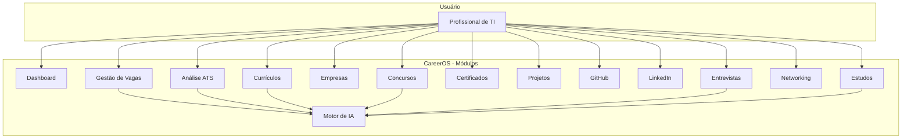
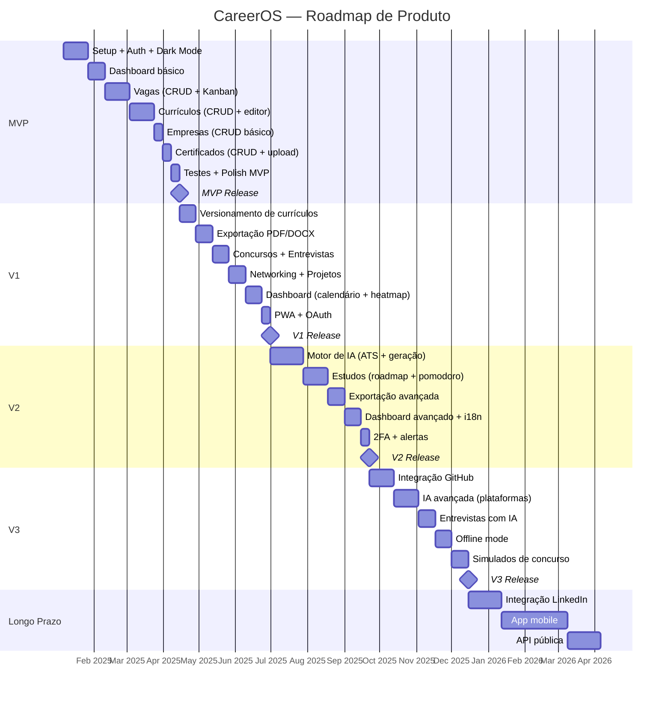

# 🚀 CareerOS — PROJECT.md

### Sistema Inteligente de Gestão de Carreira

> Documento-mestre de design e arquitetura.
> Nenhum código deve ser escrito até toda a arquitetura estar aprovada.
> A prioridade é qualidade arquitetural e visão de longo prazo.

---

## Índice

1. [Visão Geral do Produto](#1--visão-geral-do-produto)
2. [Personas](#2--personas)
3. [Casos de Uso](#3--casos-de-uso)
4. [Funcionalidades](#4--funcionalidades)
5. [Roadmap](#5--roadmap)
6. [MVP](#6--mvp)
7. [Arquitetura](#7--arquitetura)
8. [Stack Tecnológica](#8--stack-tecnológica)
9. [Modelagem do Banco](#9--modelagem-do-banco)
10. [APIs](#10--apis)
11. [Estrutura de Pastas](#11--estrutura-de-pastas)
12. [Fluxos](#12--fluxos)
13. [Wireframes](#13--wireframes)
14. [Plano de Desenvolvimento](#14--plano-de-desenvolvimento)
15. [Backlog](#15--backlog)
16. [Cronograma](#16--cronograma)
17. [Próximos Passos](#17--próximos-passos)

---

# 1 — Visão Geral do Produto

## Nome

**CareerOS** — Career Operating System

## Missão

Centralizar absolutamente tudo relacionado à vida profissional do usuário em uma única plataforma inteligente, indo muito além de um simples organizador de vagas.

## Proposta de Valor

O CareerOS é o **sistema operacional da carreira**: uma plataforma SaaS que unifica gestão de vagas, candidaturas, currículos, certificados, projetos, networking, entrevistas, concursos, estudos e inteligência artificial em um ecossistema coeso e evolutivo.

## Problema que Resolve

Profissionais de tecnologia gerenciam sua carreira de forma fragmentada:

- Vagas em planilhas
- Currículos em pastas locais sem versionamento
- Certificados espalhados em e-mails
- Networking sem rastreamento
- Nenhuma análise ATS automatizada
- Nenhum dashboard de evolução profissional
- Nenhuma IA auxiliando decisões de carreira

## Diferencial Competitivo

| CareerOS | Concorrentes (Huntr, Teal, etc.) |
|---|---|
| Análise ATS com IA + score automático | ATS básico ou inexistente |
| Versionamento de currículos (Master, Python, Cloud, Backend, IA, Segurança) | Currículo único |
| Módulo de Concursos com plano de estudos | Inexistente |
| Geração de respostas para Gupy, LinkedIn, Workday, Greenhouse | Inexistente |
| Dashboard estilo GitHub (heatmaps, KPIs) | Dashboard básico |
| PWA + offline + dark mode | Apenas web |
| Módulos de estudos com Pomodoro e roadmaps | Inexistente |
| Networking com rastreamento de contatos | Básico |

## Visão de Longo Prazo

O CareerOS deverá crescer continuamente. A arquitetura deve ser preparada para durar muitos anos, suportando:

- Integrações com GitHub, LinkedIn, plataformas de emprego
- Marketplace de templates de currículo
- Comunidade de profissionais
- API pública para extensões
- Aplicativo mobile nativo

---

# 2 — Personas

## Persona Primária: Lucas — Desenvolvedor em Transição

| Atributo | Detalhe |
|---|---|
| **Nome** | Lucas Ferreira |
| **Idade** | 28 anos |
| **Cargo atual** | Desenvolvedor Pleno (Python/Django) |
| **Situação** | Buscando transição para Staff Engineer / posições remotas internacionais |
| **Dores** | Gerencia 15+ candidaturas em planilha; não sabe se seu currículo passa no ATS; perde prazos de vagas; não tem visão de progresso |
| **Objetivos** | Centralizar candidaturas, ter currículos versionados por stack, analisar ATS automaticamente, medir evolução |
| **Cenário de uso** | Acessa o CareerOS diariamente. Cadastra novas vagas, gera currículo customizado por IA, verifica score ATS, acompanha status no Kanban |

## Persona Secundária: Mariana — Desenvolvedora Júnior

| Atributo | Detalhe |
|---|---|
| **Nome** | Mariana Costa |
| **Idade** | 23 anos |
| **Cargo atual** | Desenvolvedora Júnior (React) |
| **Situação** | Primeiro emprego, planejando crescimento técnico |
| **Dores** | Não sabe o que estudar; certificados desorganizados; não faz networking; não tem plano de carreira |
| **Objetivos** | Ter roadmap de estudos, organizar certificados, construir networking, montar portfólio |
| **Cenário de uso** | Usa o módulo de Estudos para seguir roadmaps, registra certificados, usa Pomodoro, acompanha progresso no Dashboard |

## Persona Terciária: Rafael — Concurseiro de TI

| Atributo | Detalhe |
|---|---|
| **Nome** | Rafael Mendes |
| **Idade** | 32 anos |
| **Cargo atual** | Analista de Sistemas (CLT) |
| **Situação** | Estudando para concursos de TI (SERPRO, Dataprev, BNDES) |
| **Dores** | Editais espalhados em PDFs; cronogramas manuais; não consegue medir progresso por disciplina |
| **Objetivos** | Centralizar editais, montar plano de estudos por disciplina, simular questões, acompanhar cronograma |
| **Cenário de uso** | Cadastra concursos com editais, cria plano de estudos, faz simulados gerados por IA, acompanha progresso |

---

# 3 — Casos de Uso

## Diagrama Geral

## Casos de Uso por Módulo

### Dashboard
| ID | Caso de Uso | Descrição |
|---|---|---|
| UC-D01 | Visualizar KPIs | Ver número de candidaturas, taxa de aprovação, entrevistas |
| UC-D02 | Visualizar calendário | Ver prazos, entrevistas, compromissos |
| UC-D03 | Visualizar metas | Acompanhar metas semanais/mensais |
| UC-D04 | Visualizar heatmap | Heatmap de atividade estilo GitHub |
| UC-D05 | Visualizar gráficos | Gráficos de evolução temporal |

### Gestão de Vagas
| ID | Caso de Uso | Descrição |
|---|---|---|
| UC-V01 | Cadastrar vaga | Criar vaga com empresa, salário, tecnologias, prazo |
| UC-V02 | Importar vaga | Importar dados de vaga a partir de URL |
| UC-V03 | Favoritar vaga | Marcar vaga como favorita |
| UC-V04 | Gerenciar status | Mover vaga no Kanban (Interessado → Aplicado → Entrevista → Oferta → Recusado) |
| UC-V05 | Adicionar notas | Adicionar notas e checklist a uma vaga |
| UC-V06 | Anexar documentos | Anexar currículo enviado, carta, comprovantes |
| UC-V07 | Visualizar timeline | Ver histórico de ações sobre a vaga |
| UC-V08 | Visualizar Kanban | Visão Kanban de todas as vagas |
| UC-V09 | Visualizar calendário | Ver prazos das vagas em calendário |

### ATS (Applicant Tracking System)
| ID | Caso de Uso | Descrição |
|---|---|---|
| UC-A01 | Analisar vaga | Extrair tecnologias, skills, experiência, idioma, palavras-chave |
| UC-A02 | Comparar com currículo | Comparar requisitos da vaga com dados do currículo |
| UC-A03 | Gerar score ATS | Calcular percentual de aderência |
| UC-A04 | Mostrar gaps | Listar o que está faltando no currículo |
| UC-A05 | Sugerir melhorias | IA sugere adições ao currículo para aumentar score |

### Currículos
| ID | Caso de Uso | Descrição |
|---|---|---|
| UC-C01 | Criar currículo | Criar novo currículo (Master, Python, Cloud, Backend, IA, Segurança) |
| UC-C02 | Versionar currículo | Salvar versão, comparar versões, restaurar versão |
| UC-C03 | Editar currículo | Editar seções do currículo |
| UC-C04 | Exportar currículo | Exportar em PDF, DOCX, Markdown, LaTeX, JSON |
| UC-C05 | Gerar currículo por IA | IA gera currículo otimizado para vaga específica |

### Empresas
| ID | Caso de Uso | Descrição |
|---|---|---|
| UC-E01 | Cadastrar empresa | Nome, área, benefícios, faixa salarial, tecnologias |
| UC-E02 | Registrar processo seletivo | Vincular processo seletivo à empresa |
| UC-E03 | Avaliar empresa | Adicionar avaliação pessoal |
| UC-E04 | Ver histórico | Histórico de interações com a empresa |

### Concursos
| ID | Caso de Uso | Descrição |
|---|---|---|
| UC-CO01 | Cadastrar concurso | Edital, cronograma, banca, disciplinas |
| UC-CO02 | Criar plano de estudos | Plano por disciplina com horas e progresso |
| UC-CO03 | Fazer simulado | Simulados gerados por IA por disciplina |
| UC-CO04 | Registrar resultado | Registrar nota e classificação |

### Certificados
| ID | Caso de Uso | Descrição |
|---|---|---|
| UC-CE01 | Cadastrar certificado | Curso, instituição, carga horária, validade, categoria |
| UC-CE02 | Anexar PDF | Upload do certificado |
| UC-CE03 | Categorizar | Organizar por categorias (Cloud, Dev, Data, etc.) |
| UC-CE04 | Alertar validade | Notificação de certificados prestes a expirar |

### Projetos
| ID | Caso de Uso | Descrição |
|---|---|---|
| UC-P01 | Cadastrar projeto | Nome, descrição, tecnologias, link GitHub |
| UC-P02 | Vincular a currículo | Associar projeto a currículos específicos |
| UC-P03 | Sincronizar GitHub | Importar dados do repositório (futuro) |

### Estudos
| ID | Caso de Uso | Descrição |
|---|---|---|
| UC-ES01 | Seguir roadmap | Roadmaps de estudo por área |
| UC-ES02 | Registrar horas | Timer Pomodoro + log de horas |
| UC-ES03 | Registrar curso/livro | Cadastrar recursos de estudo |
| UC-ES04 | Ver progresso | Dashboard de progresso por área |

### Networking
| ID | Caso de Uso | Descrição |
|---|---|---|
| UC-N01 | Cadastrar contato | Nome, empresa, cargo, LinkedIn, observações |
| UC-N02 | Registrar interação | Data e tipo do último contato |
| UC-N03 | Lembrete de follow-up | Alertas para manter contato ativo |

### Entrevistas
| ID | Caso de Uso | Descrição |
|---|---|---|
| UC-EN01 | Cadastrar entrevista | Empresa, data, entrevistador, tipo |
| UC-EN02 | Registrar perguntas | Documentar perguntas feitas |
| UC-EN03 | Registrar feedback | Feedback recebido e auto-avaliação |
| UC-EN04 | Simular entrevista | IA gera perguntas para prática |

### IA
| ID | Caso de Uso | Descrição |
|---|---|---|
| UC-IA01 | Analisar vaga (ATS) | Parsing e extração de requisitos da vaga |
| UC-IA02 | Gerar currículo | Currículo otimizado para vaga específica |
| UC-IA03 | Gerar carta de apresentação | Carta personalizada por vaga/empresa |
| UC-IA04 | Gerar respostas para plataformas | Respostas para Gupy, LinkedIn, Workday, Greenhouse |
| UC-IA05 | Gerar plano de estudos | Roadmap personalizado baseado em gaps |
| UC-IA06 | Gerar simulado | Questões de concurso por disciplina |
| UC-IA07 | Gerar perguntas de entrevista | Perguntas prováveis baseadas na vaga |
| UC-IA08 | Gerar plano de carreira | Plano de evolução baseado no perfil |
| UC-IA09 | Comparar currículo vs vaga | Score de aderência + gaps |

---

# 4 — Funcionalidades

## Classificação por Fase

| Módulo | Funcionalidade | MVP | V1 | V2 | V3 | Longo Prazo |
|---|---|:---:|:---:|:---:|:---:|:---:|
| **Auth** | Registro/Login (email+senha) | ✅ | | | | |
| **Auth** | OAuth (Google, GitHub) | | ✅ | | | |
| **Auth** | 2FA | | | ✅ | | |
| **Dashboard** | KPIs básicos (candidaturas, entrevistas) | ✅ | | | | |
| **Dashboard** | Calendário | | ✅ | | | |
| **Dashboard** | Heatmap de atividade | | ✅ | | | |
| **Dashboard** | Metas | | | ✅ | | |
| **Dashboard** | Gráficos avançados | | | ✅ | | |
| **Vagas** | CRUD de vagas | ✅ | | | | |
| **Vagas** | Status/Kanban | ✅ | | | | |
| **Vagas** | Favoritar | ✅ | | | | |
| **Vagas** | Notas e checklist | ✅ | | | | |
| **Vagas** | Importar vaga por URL | | ✅ | | | |
| **Vagas** | Anexos | | ✅ | | | |
| **Vagas** | Timeline | | | ✅ | | |
| **Vagas** | Calendário de vagas | | | ✅ | | |
| **ATS** | Análise manual de vaga | | ✅ | | | |
| **ATS** | Score ATS automático | | | ✅ | | |
| **ATS** | Sugestões de melhoria via IA | | | ✅ | | |
| **Currículos** | CRUD com editor | ✅ | | | | |
| **Currículos** | Múltiplos currículos (por stack) | ✅ | | | | |
| **Currículos** | Versionamento | | ✅ | | | |
| **Currículos** | Exportação PDF/DOCX | | ✅ | | | |
| **Currículos** | Exportação Markdown/LaTeX/JSON | | | ✅ | | |
| **Currículos** | Geração por IA | | | ✅ | | |
| **Empresas** | CRUD básico | ✅ | | | | |
| **Empresas** | Processos seletivos | | ✅ | | | |
| **Empresas** | Avaliações e histórico | | | ✅ | | |
| **Concursos** | CRUD com edital | | ✅ | | | |
| **Concursos** | Plano de estudos | | | ✅ | | |
| **Concursos** | Simulados via IA | | | | ✅ | |
| **Certificados** | CRUD com upload | ✅ | | | | |
| **Certificados** | Categorização | | ✅ | | | |
| **Certificados** | Alertas de validade | | | ✅ | | |
| **Projetos** | CRUD básico | | ✅ | | | |
| **Projetos** | Vínculo com currículos | | ✅ | | | |
| **Projetos** | Sync GitHub | | | | ✅ | |
| **GitHub** | Integração API | | | | ✅ | |
| **GitHub** | Listar repos, commits, PRs | | | | ✅ | |
| **LinkedIn** | Integração básica | | | | | ✅ |
| **LinkedIn** | Salvar vagas, networking, posts | | | | | ✅ |
| **Estudos** | Roadmaps | | | ✅ | | |
| **Estudos** | Pomodoro | | | ✅ | | |
| **Estudos** | Log de horas e progresso | | | ✅ | | |
| **Networking** | CRUD de contatos | | ✅ | | | |
| **Networking** | Lembretes de follow-up | | | ✅ | | |
| **Entrevistas** | CRUD básico | | ✅ | | | |
| **Entrevistas** | Simulação via IA | | | | ✅ | |
| **IA** | Análise ATS | | | ✅ | | |
| **IA** | Geração de currículo | | | ✅ | | |
| **IA** | Geração de carta | | | ✅ | | |
| **IA** | Respostas para plataformas | | | | ✅ | |
| **IA** | Plano de carreira | | | | ✅ | |
| **Infra** | PWA básico | | ✅ | | | |
| **Infra** | Dark mode | ✅ | | | | |
| **Infra** | Internacionalização (pt-BR, en) | | | ✅ | | |
| **Infra** | Offline mode | | | | ✅ | |

---

# 5 — Roadmap

---

# 6 — MVP

## Escopo do MVP

O MVP entrega o **core funcional** que permite a um profissional de TI centralizar vagas, currículos, empresas e certificados com um dashboard de acompanhamento.

### Módulos Incluídos

| Módulo | Funcionalidades |
|---|---|
| **Auth** | Registro, login, recuperação de senha (email+senha) |
| **Dashboard** | KPIs: total de candidaturas, taxa de entrevistas, salários médios, próximos prazos |
| **Vagas** | CRUD, status (Kanban 5 colunas), favoritar, notas, checklist |
| **Currículos** | CRUD, editor de seções, múltiplos currículos por stack |
| **Empresas** | CRUD básico (nome, área, benefícios, faixa salarial, tecnologias) |
| **Certificados** | CRUD, upload de PDF, carga horária, validade |
| **Infra** | Dark mode, responsivo, mobile-first |

### Critérios de Aceite do MVP

- [ ] Usuário consegue se registrar e fazer login
- [ ] Usuário consegue criar, editar, excluir e visualizar vagas
- [ ] Vagas podem ser movidas entre colunas do Kanban (drag & drop)
- [ ] Usuário consegue criar múltiplos currículos com seções editáveis
- [ ] Usuário consegue cadastrar empresas e vincular a vagas
- [ ] Usuário consegue cadastrar certificados com upload de arquivo
- [ ] Dashboard exibe KPIs atualizados em tempo real
- [ ] Interface responsiva funcional em mobile e desktop
- [ ] Dark mode funcional
- [ ] Todos os CRUDs possuem validação de dados
- [ ] Cobertura de testes ≥ 70%

### Tempo Estimado: ~14 semanas

---

---

> **Nota:** As seções de Arquitetura, Banco de Dados, APIs e Stack Técnica foram movidas para o arquivo `ARCHITECTURE.md`.
